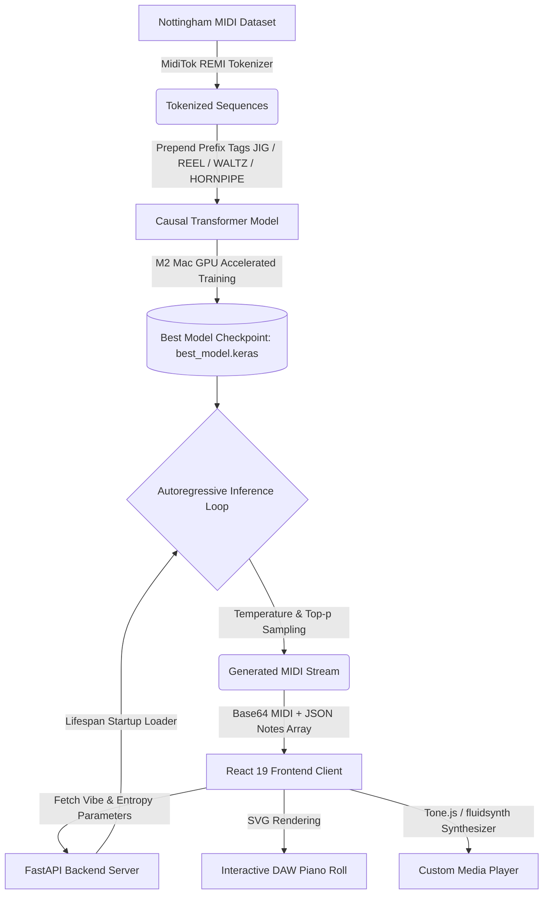

# 🎵 Aether Studio: Mood-Conditioned Music Transformer

Aether Studio is a generative music platform powered by an autoregressive Causal Transformer (GPT-style). It features prefix style conditioning (Jigs, Reels, Waltzes, Hornpipes), event-based REMI tokenization, Apple Metal GPU-accelerated training, and a minimal, responsive React + TypeScript web application.

---

## 🏗️ System Architecture & Data Flow



---

## 📁 Repository Structure

```text
music-generator/
├── backend/                  # FastAPI Application & API Server
│   ├── Dockerfile            # Backend Docker image configuration
│   ├── main.py               # FastAPI endpoints (/generate, /synthesize, /)
│   └── requirements.txt      # Backend Python dependencies
├── src/                      # Core Machine Learning & Transformer Engine
│   ├── __init__.py
│   ├── model.py              # Causal Transformer Decoder & Custom Layers
│   ├── tokenizer.py          # REMI Tokenizer configuration
│   ├── preprocess.py         # Dataset preparation & sequence tokenization
│   ├── train.py              # Model training loop (M2 GPU accelerated)
│   └── generate.py           # Autoregressive generation CLI (Top-p & Temp)
├── frontend/                 # React 19 + TypeScript + Vite Web Client
│   ├── src/
│   │   ├── App.tsx           # Minimal, responsive music generator UI
│   │   ├── index.css         # Modern, lightweight stylesheet
│   │   └── main.tsx          # TypeScript entrypoint
│   ├── public/
│   ├── Dockerfile            # Multi-stage Nginx container build
│   ├── package.json
│   ├── tsconfig.json
│   └── vite.config.js
├── tests/                    # Unit Test Suite
│   ├── __init__.py
│   ├── test_model.py         # Transformer layer shape assertions
│   ├── test_tokenizer.py     # Tokenizer & special prefix token tests
│   └── test_generate.py      # Sampling & boundary math tests
├── data/                     # Dataset Storage
│   ├── midi_dataset/         # Classified Nottingham MIDI files
│   └── tokenized_sequences.pkl
├── models/                   # Model Artifacts
│   ├── best_model.keras      # Trained Transformer weights checkpoint
│   └── tokenizer.json        # REMI Tokenizer vocabulary parameters
├── legacy/                   # Archived Legacy Files (LSTM / Notebooks)
│   ├── app.py                # Legacy Streamlit UI
│   ├── model.py              # Legacy LSTM architecture
│   ├── model.ipynb           # Colab notebook
│   ├── generate_midi.ipynb   # Colab notebook
│   ├── weights.hdf5          # Legacy LSTM weights
│   └── notes                 # Legacy notes pickle
├── docker-compose.yml        # Multi-container orchestration (Frontend + Backend)
├── requirements.txt          # Root Python dependencies
├── .gitignore                # Comprehensive ignore rules
└── README.md                 # Documentation & Architecture Guide
```

---

## 🧠 Model Architecture & Deep Learning Foundations

Aether Studio implements a **Decoder-only Causal Transformer (GPT-style)** utilizing TensorFlow 2.17.0 and Apple Metal Performance Shaders (`tensorflow-metal`) for accelerated hardware training.

### Key Components:
1. **Event-Based Tokenization (REMI Representation)**: Tokenizer built with `MidiTok` represents music as a continuous sequence of events: `Bar_None`, `Position_X`, `Pitch_Y`, `Velocity_Z`, and `Duration_W`. Vocabulary size: **318 tokens**.
2. **Causal Multi-Head Self-Attention**: Applies a lower-triangular causal attention mask so that each generated token is conditioned strictly on the preceding context history:
   $$Q = XW_Q, \quad K = XW_K, \quad V = XW_V$$
   $$\text{Attention}(Q, K, V) = \text{softmax}\left(\frac{QK^T}{\sqrt{d_k}} + M\right)V$$
   Where $M$ is the causal attention mask ($M_{ij} = 0$ for $i \ge j$, and $-\infty$ otherwise).
3. **Prefix Style Conditioning**: Prepending a style prefix token (e.g. `[JIG]` at index 0) to every training slice conditions the model to generate style-specific rhythms, meters, and tempos.

---

## 🎚️ Mathematical Sampling Mechanics

### 1. Temperature Scaling
The model predicts a raw logit vector $z$ over the vocabulary. Logits are scaled by temperature $T > 0$:
\[ p_i = \frac{\exp(z_i / T)}{\sum_{j \in V} \exp(z_j / T)} \]
* **Low $T$ ($0.4 - 0.7$)**: Peaks the probability distribution for more deterministic output.
* **High $T$ ($1.1 - 1.5$)**: Flattens the distribution, increasing diversity and novelty.

### 2. Nucleus (Top-p) Sampling
Selects the smallest subset of tokens $U \subset V$ whose cumulative probability sum meets threshold $p \in (0, 1]$:
\[ \sum_{i \in U} p'_i \ge p \]
The remaining tokens are discarded, and probabilities are re-normalized over $U$:
\[ p''_i = \frac{p'_i}{\sum_{j \in U} p'_j} \]

---

## 🛠️ Installation & Setup

### Local Quickstart

#### 1. Configure Python Virtual Environment:
```bash
python3.11 -m venv venv
source venv/bin/activate
pip install -r requirements.txt
```

#### 2. Run Unit Tests:
```bash
python -m unittest discover -s tests
```

#### 3. Run the FastAPI Backend Server:
```bash
./venv/bin/uvicorn backend.main:app --reload --port 8000
```
*API runs at `http://127.0.0.1:8000`.*

#### 4. Start the React Frontend:
```bash
cd frontend
npm install
npm run dev
```
*Frontend runs at `http://localhost:5173/`.*

---

## 🐳 Containerization with Docker

Launch both services via Docker Compose:
```bash
docker-compose up --build
```

* **Frontend UI Client**: `http://localhost:3000`
* **Backend API Server**: `http://localhost:8000`
